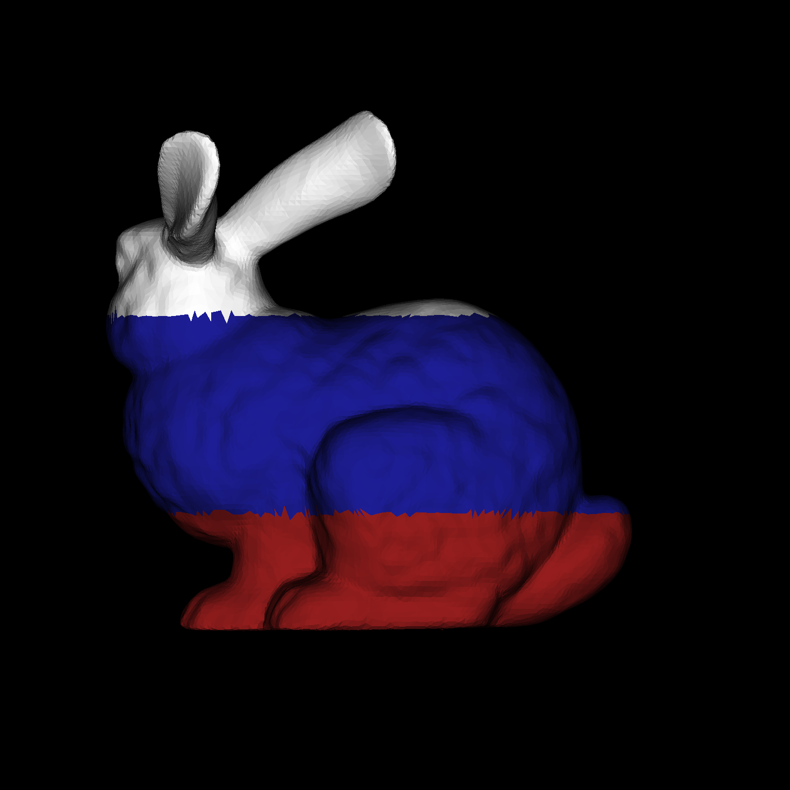
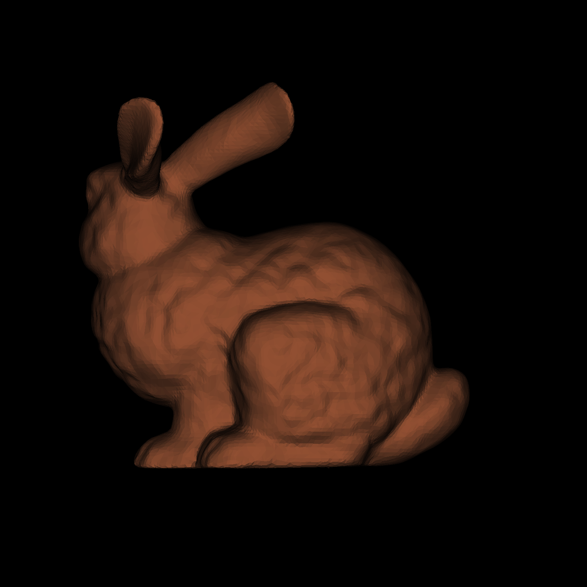
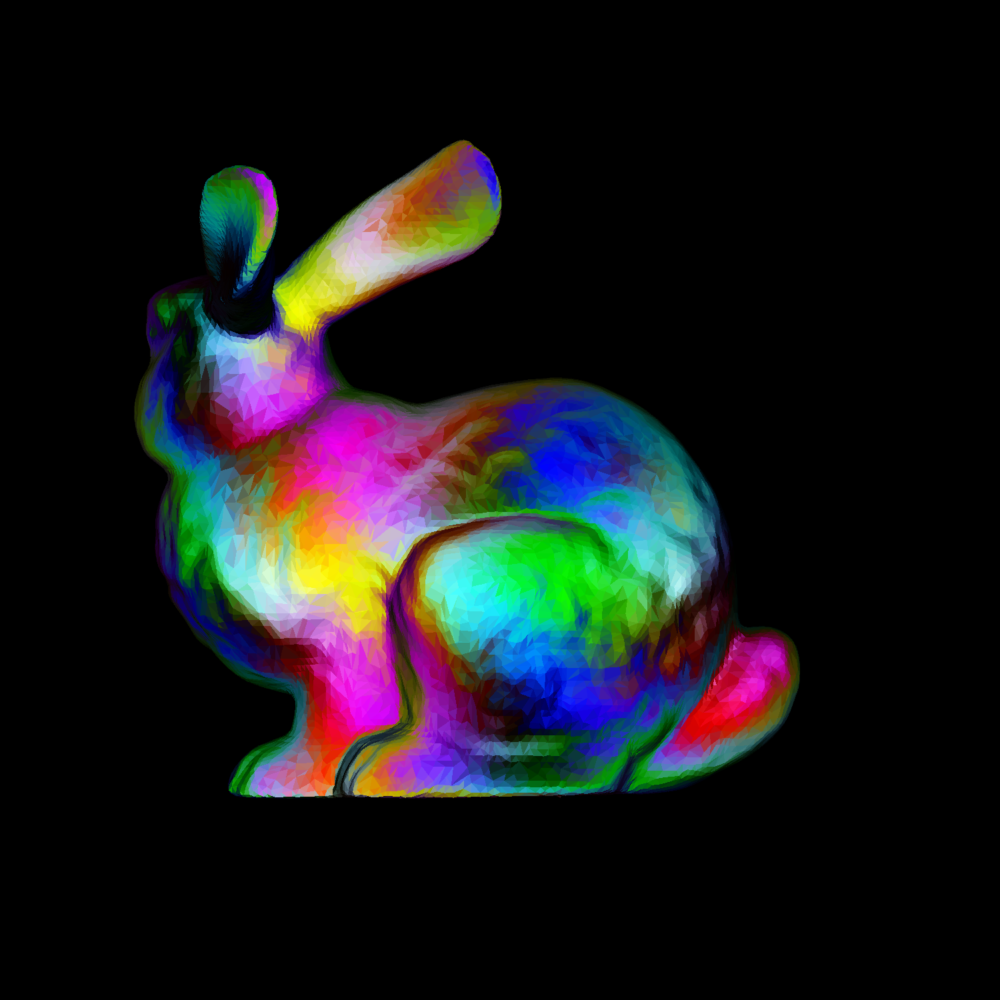
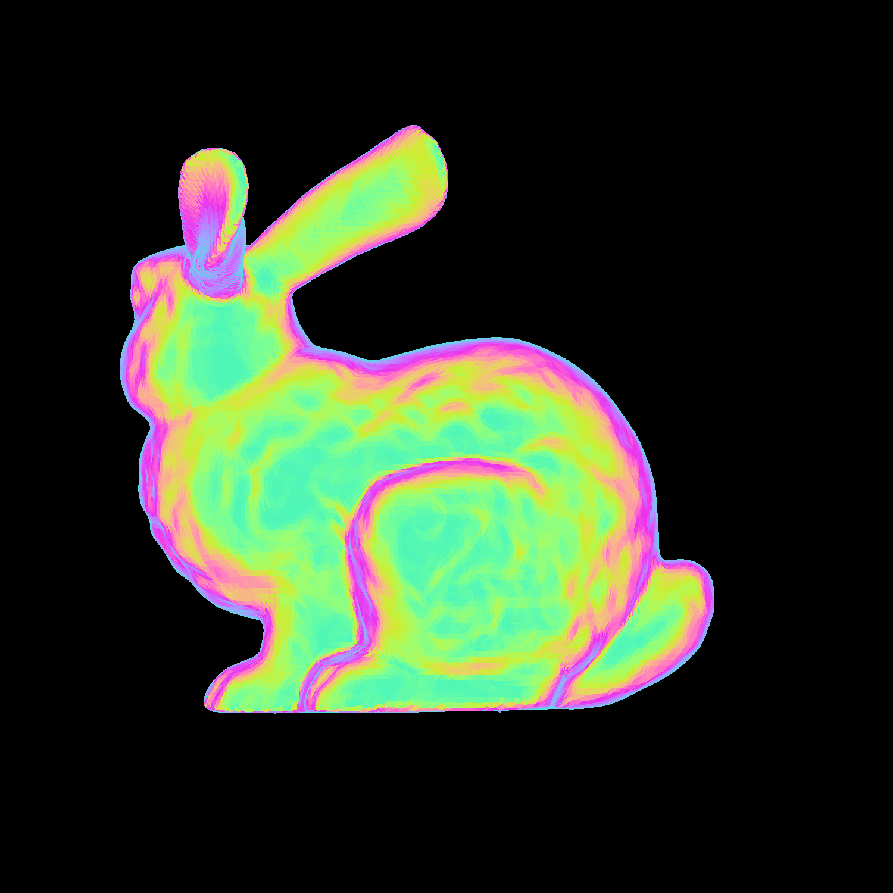

# Лабораторная работа по компьютерной графике №2
## Выполнил
**Чичкин Данила Александрович**
**6204-010302D**
*15.10.2025*

## Описание
 Реализация базовых алгоритмов компьютерной графики: работа с изображениями, работа с 3D моделями.

## Результаты работы






## Зависимости
- Python 3.8+
- NumPy
- Pillow (PIL)

## Установка и запуск

```bash
# Установка зависимостей
pip install -r requirements.txt

# Запуск конкретного задания
python src/main.py
```
